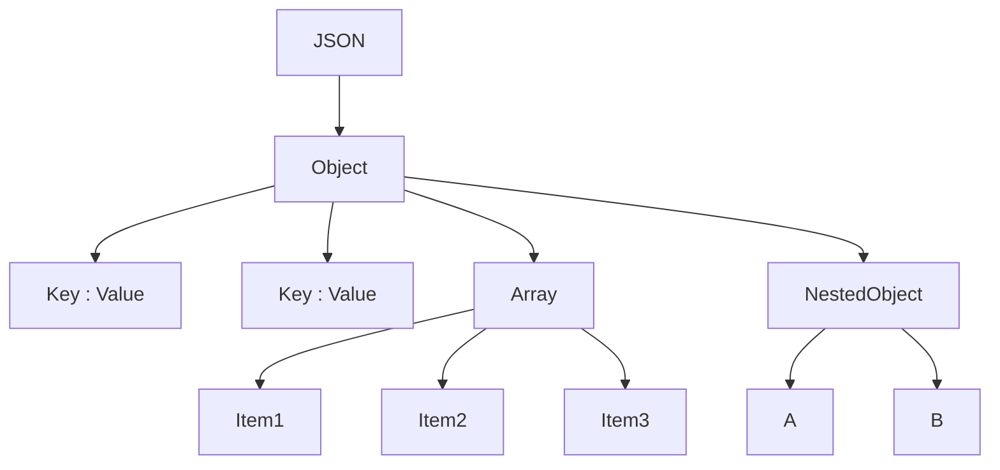
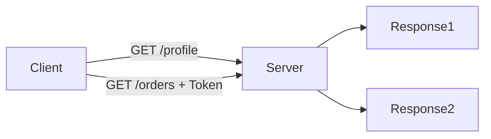
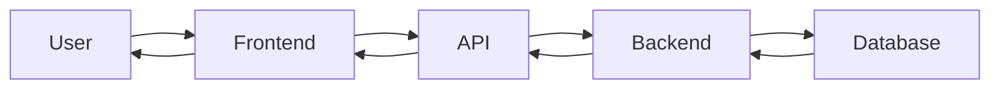
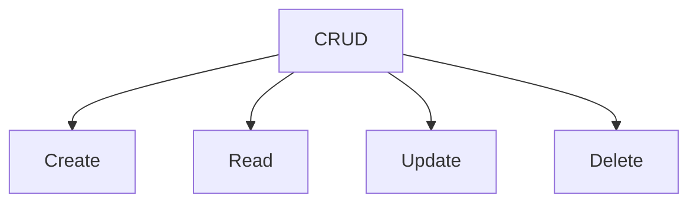
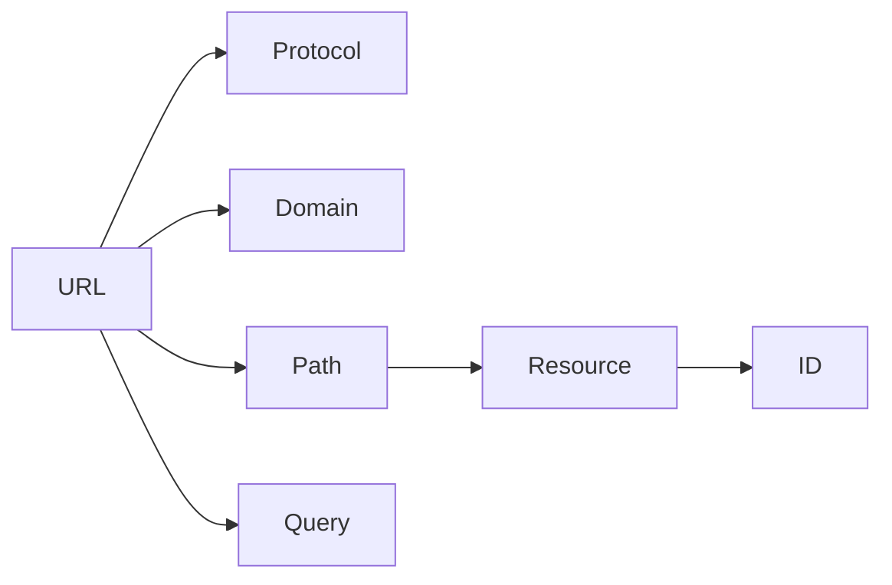
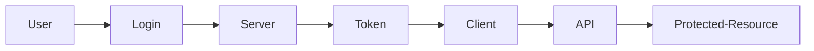
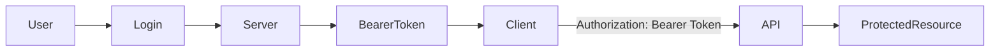

# 🌐 API & HTTP Basics Notes

> Beginner-friendly notes covering JSON, Stateless HTTP, APIs, CRUD, HTTP Methods, Status Codes, URLs, and Authentication.

---

# 📚 Table of Contents

- [1. What is JSON?](#1-what-is-json)
- [2. Stateless Protocol](#2-stateless-protocol)
- [3. What is an API?](#3-what-is-an-api)
- [4. Resources (Frontend & Backend)](#4-resources-frontend--backend)
- [5. CRUD Operations](#5-crud-operations)
- [6. HTTP Methods (Verbs)](#6-http-methods-verbs)
- [7. HTTP Status Codes](#7-http-status-codes)
- [8. URL Explained](#8-url-explained)
- [9. Authentication Basics](#9-authentication-basics)

---

# 1. What is JSON?

## Definition

**JSON (JavaScript Object Notation)** is a lightweight text-based data format used to **store and exchange data** between applications.

Although it originated from JavaScript, JSON is language-independent and supported by almost every programming language.

---

## Why is JSON Used?

- Easy to read
- Easy to write
- Lightweight
- Fast to transmit
- Easy for machines to parse
- Standard format for REST APIs

---

## JSON Rules

### 1. Data is stored as Key-Value pairs

```json
{
  "product-name":"monitor",
  "price": "6000"
}
```

---

### 2. Keys must be inside double quotes

```json
{
  "age": 20    //✅ Correct
  age: 20     //❌ Wrong
}
```
---

### 3. Strings use double quotes

```json
{
  "city": "Delhi"
}
```

---

### 4. Numbers don't need quotes

```json
{
  "marks": 95
}
```

---

### 5. Boolean values

```json
{
  "passed": true
}
```

---

### 6. Null values

```json
{
  "middleName": null
}
```

---

### 7. Arrays

```json
{
  "skills": [
    "HTML",
    "CSS",
    "JavaScript"
  ]
}
```

---

### 8. Nested Objects

```json
{
  "student": {
    "name": "Alice",
    "age": 20
  }
}
```

---

## Complete Example

```json
{
  "id": 101,
  "name": "Laptop",
  "price": 65000,
  "stock": true,
  "colors": [
    "Black",
    "Silver"
  ],
  "manufacturer": {
    "name": "Dell",
    "country": "India"
  }
}
```

---

## JSON Structure Flowchart



---

# 2. Stateless Protocol

## What is Stateless?

A **stateless protocol** means the server **does not remember previous requests**.

Every request is completely independent.

---

## Why HTTP is Stateless

Example

Request 1

```
GET /profile
```

Server sends profile.

Later

```
GET /orders
```

The server doesn't know who is requesting.

So the client must send authentication again.

```
Authorization: Bearer token
```

---

## Flowchart



---

## Advantages

- Easier to scale
- Faster
- Simpler architecture
- Better load balancing

---

# 3. What is an API?

## Definition

**API (Application Programming Interface)** allows two software applications to communicate.

---

## Restaurant Analogy

```
Customer
     ↓
 Waiter (API)
     ↓
 Kitchen (Server)
     ↓
 Food
```

The waiter takes your request to the kitchen and brings the food back.

Similarly,

The API carries requests from the frontend to the backend and returns responses.

---

## API Flow



---

## Common API Examples:
```
Google Maps API
Payment APIs
Login API
Social Media API
Weather API
Ecommerce API
E-learning API
```
---

# 4. Resources (Frontend & Backend)

## What is a Resource?

A resource is any piece of data managed by the server.

Examples

- User
- Student
- Book
- Product
- Employee
- Order

Resources are identified by URLs.

```
/users
/products
```

---

# 5. CRUD Operations

CRUD stands for

| Letter | Meaning |
|---------|----------|
| C | Create |
| R | Read |
| U | Update |
| D | Delete |

---

Example

```
/students
```

You can

- Create Student
- Read Student
- Update Student
- Delete Student

---

## CRUD Mapping

| CRUD | HTTP Method |
|-------|-------------|
| Create | POST |
| Read | GET |
| Update | PUT / PATCH |
| Delete | DELETE |

---

## CRUD Flowchart



---

# 6. HTTP Methods (Verbs)

HTTP methods tell the server **what action** should be performed.

## Summary

| Method | CRUD | Purpose | Example |
|:--------:|:----:|:-------:|:------:|
| GET | Read | Retrieve data | GET/api/documents |
| POST | Create | Add data | POST/api/documents |
| PUT | Update | Replace entire resource | PUT/api/documents/88 |
| PATCH | Partial Update | Modify selected fields | PATCh/api/documents/101 |
| DELETE | Delete | Remove data | DELETE/api/documents/99 |

---

## Memory Trick

```
GET     → Read 📖

POST    → Create ➕

PUT     → Replace ♻️

PATCH   → Modify ✏️

DELETE  → Remove ❌
```

---

# 7. HTTP Status Codes

## What are Status Codes?

Status codes are **3-digit numbers** returned by the server to indicate the result of a request.

---

## Categories

| Range | Meaning |
|--------|---------|
| 1xx | Information |
| 2xx | Success |
| 3xx | Redirect |
| 4xx | Client Error |
| 5xx | Server Error |

---

## Common Status Codes

| Code | Meaning |
|------|----------|
| 200 | OK |
| 201 | Created |
| 204 | No Content |
| 301 | Moved Permanently |
| 302 | Temporary Redirect |
| 304 | Not Modified |
| 400 | Bad Request |
| 401 | Unauthorized |
| 403 | Forbidden |
| 404 | Not Found |
| 405 | Method Not Allowed |
| 406 | Not Acceptable |
| 408 | Request Timeout |
| 409 | Conflict |
| 410 | Gone |
| 415 | Unsupported Media Type |
| 422 | Validation Error |
| 429 | Too Many Requests |
| 500 | Internal Server Error |
| 501 | Not Implemented |
| 502 | Bad Gateway |
| 503 | Service Unavailable |
| 504 | Gateway Timeout |
---


# 8. URL Explained

## What is a URL?

A URL (Uniform Resource Locator) is the address of a resource on the Internet.

Example

```
https://api.example.com/users/15?active=true
```

```
Protocol
   ↓
Domain
   ↓
Path
   ↓
Resource
   ↓
Query Parameters
```

---

## URL Breakdown

```
https://api.example.com/users/15?active=true
```

| Part | Meaning |
|------|----------|
| https | Protocol |
| api.example.com | Domain |
| /users | Resource |
| /15 | Resource ID |
| active=true | Query Parameter |

---

## Flowchart



---

# 9. Authentication Basics

Authentication verifies **who is making the request**.

Without authentication, anyone could access protected data.

---

# API Keys

An API Key identifies your application.

Example

```
GET /weather

x-api-key: abc123xyz
```

### Analogy

API Key = Library Membership Card

You show the card.

The library recognizes you.

---

# Bearer Token

Bearer Token identifies a logged-in user.

```
Authorization: Bearer eyJhbGc...
```

---

## Login Flow



---

## API Key vs Bearer Token

| API Key | Bearer Token |
|----------|--------------|
| Identifies application | Identifies user |
| Usually long-lived | Usually temporary |
| Given by API provider | Generated after login |
| Less secure for user identity | More secure for authenticated access |

---

# .env File

A `.env` file stores secret information separately from the source code.

Example

```env
API_KEY=abc123xyz
JWT_SECRET=mySecretKey
DATABASE_URL=mysql://localhost/app
```

---

## Why Use `.env`?

- Keeps secrets safe
- Prevents exposing keys on GitHub
- Makes configuration easier
- Supports different environments (development, testing, production)

> **Never upload your `.env` file to GitHub.** Add it to `.gitignore`.

---

## Authentication Flow



---

# 📖 Quick Revision Table

| Topic | Key Point |
|--------|-----------|
| JSON | Standard format for exchanging data |
| Stateless | Server remembers nothing between requests |
| API | Bridge between client and server |
| Resource | Data managed by the server |
| CRUD | Create, Read, Update, Delete |
| GET | Retrieve data |
| POST | Create data |
| PUT | Replace entire resource |
| PATCH | Update selected fields |
| DELETE | Remove data |
| Status Codes | Tell the result of a request |
| URL | Address of a resource |
| API Key | Identifies an application |
| Bearer Token | Identifies an authenticated user |
| `.env` | Stores secrets securely |
---
# 🚀 Quick Revision Chart
````markdown
# 🚀 Quick Revision Chart

```text
                               🌐 API & HTTP Basics
                                        │
 ┌───────────────────────────────────┼───────────────────────────────────┐
 │                                   │                                   │
 ▼                                   ▼                                   ▼
 JSON                               HTTP                                API
 │                                   │                                   │
 ├─ Data Format                      ├─ Stateless                        ├─ Bridge between
 ├─ Key : Value                      ├─ Request → Response               │  Client & Server
 ├─ Objects                          ├─ Methods                          └─ Examples
 └─ Arrays                           └─ Status Codes                        • Weather
                                                                            • Maps
                                                                            • Payments


                                │
                                ▼
                              CRUD
        ┌──────────────┬──────────────┬──────────────┐
        ▼              ▼              ▼              ▼
     Create         Read          Update         Delete
      POST           GET       PUT / PATCH      DELETE

                            │
                            ▼
                        HTTP Methods
                        GET → Read
                        POST → Create
                        PUT → Replace Entire Resource
                        PATCH → Update Specific Fields
                        DELETE → Remove Resource

                                    │
                                    ▼
                             Status Codes
                            2xx ✅ Success
                            3xx ➜ Redirect
                            4xx ❌ Client Error
                            5xx 💥 Server Error

                                        │
                                        ▼
                                      URL
       Protocol → Domain → Path → Resource ID → Query Parameters

                                        │
                                        ▼
                                Authentication
              ┌──────────────────────┼──────────────────────┐
              ▼                      ▼                      ▼
          API Key              Bearer Token              .env File
      Identifies App        Identifies User         Stores Secrets
```
````

