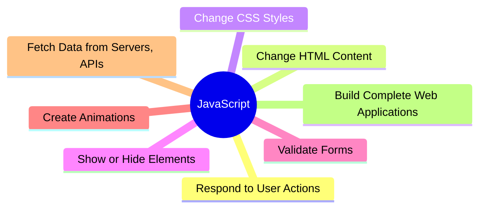
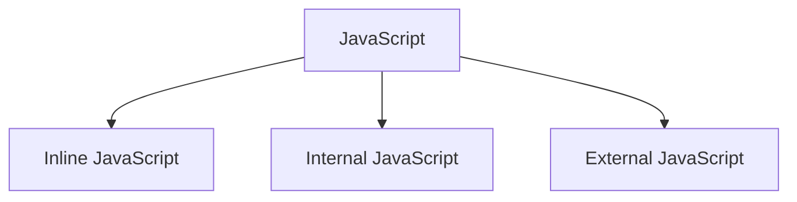
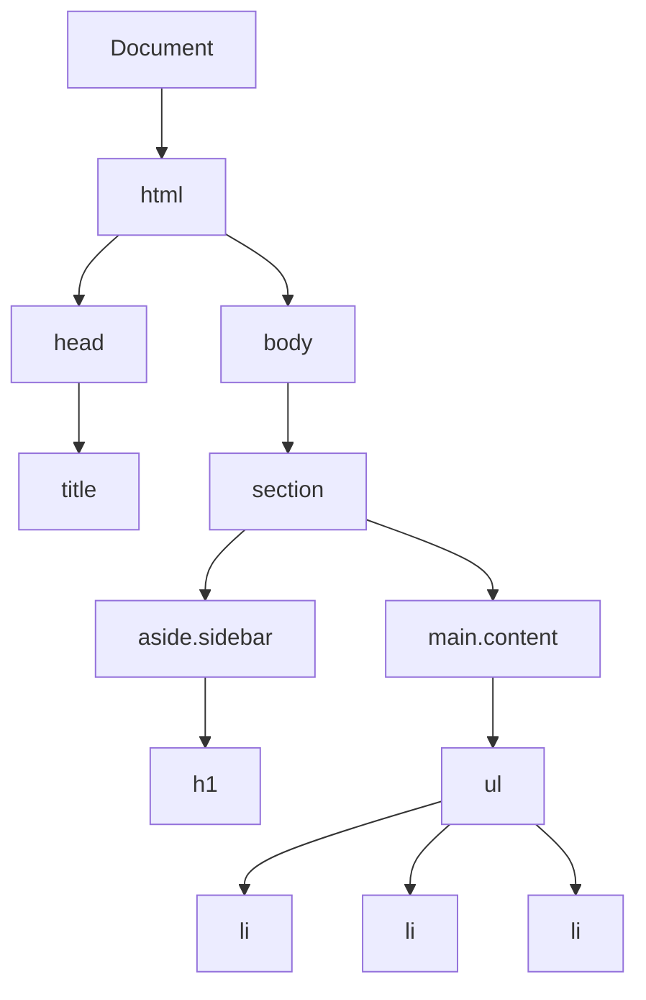

<<<<<<< HEAD
# javascript-notes
Comprehensive JavaScript DOM notes covering DOM manipulation, element selection, content updates, traversal, and modern selectors with practical examples for beginners.
=======
# ***Javascript Fundamentals*** 

# 1. What is Javascript
JavaScript (JS) is a programming language that makes web pages interactive and dynamic.

While HTML provides the structure and CSS provides the styling, JavaScript adds behavior and functionality.

| Technology	| Purpose |
|:--------|:------|
| HTML	| Creates the structure of a webpage |
| CSS	| Styles and designs the webpage |
| JavaScript	| Adds interactivity and logic |




# 2 Ways to Embed JavaScript
JavaScript can be added to HTML in **3 ways**:


# a`)`Inline JavaScript
-JavaScript is written directly inside an HTML element using event attributes like onclick, onchange, etc.
-Useed for small examples and testing
-It is simple but difficult to maintain.
-Example:
```
<button onclick="alert('Hello')"> Click Me </button>
```

# b`)`Internal JavaScript
-JavaScript is written inside a `<script>` tag within the same HTML file, usually in the `<head>` or before the closing `</body>` tag.
-Used for small websites or single-page applications.
-Example:
```
<script>
  console.log("Hello from internal script");
</script>
```

# c`)`External JavaScript
-JavaScript is stored in a separate .js file and linked to the HTML using the `<script src="..."></script>` tag.
-It improves readability, reusability, maintainability, and browser caching, making it the preferred method for most web applications.
-Example:
```
<script src="script.js"></script>
```
***#NOTE***:
**Best Practice**: Use External JavaScript for real-world projects because it keeps your HTML clean and allows the same JavaScript file to be reused across multiple web pages.

# Where to Put`<script>` 
The location of the`<script>`tag affects when JavaScript is loaded and executed. Choosing the right location helps improve page performance and prevents errors.
| Location	| Description	| Advantages	| Disadvantages |
|:--------|:------:|:------:|:------:|
| Inside`<head>`| JavaScript is loaded before the HTML body.	| Suitable for scripts that must load early.	| HTML elements may not exist yet, causing DOM-related errors and slower page rendering. |
| Before`</body>`| JavaScript is loaded after the HTML content has been parsed.	| Ensures all HTML elements are available, improves page loading, and reduces errors.	| Scripts start downloading only after the HTML is parsed. |

# 3. What is the DOM?
DOM stands for ***Document Object Mode***l.
-The browser converts an HTML document into a tree-like structure of objects called the DOM.
-JavaScript uses the DOM toaccess, modify, add, or remove elements, change text, update styles, and respond to user actions.
-Example
```
<!DOCTYPE html>
<html>
  <head>
      <title>DOM Example</title>
  </head>
  <body>
      <section>
        <aside class="sidebar">
          <h1></h1>
        </aside>
        <main class="content">
          <ul>
            <li></li>
            <li></li>
            <li></li>
          </ul>
        </main>
      </section>
  </body>
</html>
```
-DOM tree:

***#NOTE***
Open Chrome DevTools → Console tab → you can write JS directly here to poke at the DOM and see what gets returned.
document.getElementByTagName("h1")

# 4. Selecting Elements — getElement... Methods
Before modifying an element, JavaScript must first select it.

## getElementById
Selects one element using its ID.
returns a single value since id is unique for each element/tag.
Example:
```
document.getElementById("list");
``` 
## getElementsByClassName
Selects all elements with a given class.
Returns an HTMLCollection (array-like or list)all elements that have same class.
Example:
``` 
document.getElementsByClassName("sidebar")
```
## getElementsByTagName
Selects elements by HTML tag.
Example:
``` 
document.getElementsByTagName("li")
```
***#NOTE***
 **querySelector()/ querySelectorAll()**:
  -Modern JavaScript provides two powerful methods for selecting HTML elements using CSS selectors.
  -Unlike the getElement... methods, these functions can select elements using IDs, classes, tags, attributes, pseudo-classes, and more.

  | querySelector() | querySelectorAll() |
  |:--------:| :-----:|
  | selects the first element that matches a specified CSS selector. | selects all matching elements and returns a NodeList. |
  | document.querySelector("li") //returns the first match element | document.querySelectorAll("li") //returns list of all matching elements |

***#NOTE***
In modern JavaScript, developers generally prefer querySelector() and querySelectorAll() because they support all CSS selectors and make code more flexible, readable, and consistent.

# 5. Ways to Change Content
JavaScript can modify webpage content in several ways.
| Method	| Description |
|:--------:| :-----:|
| innerHTML | Changes or retrieves the HTML content inside an element. |
| innerText | Changes or retrieves only the visible text of an element. It ignores hidden text and treats HTML tags as plain text. |
| textContent | Changes or retrieves all text inside an element, including hidden text. It does not parse HTML tags. |

# 6.Selecting an Element and Changing it
Selecting element:
```
document.querySelector('.content ul li')
```
It selects first li inside the ul inside content class as querySelector`()`returns a single value. 

Changing Color:
```
document.querySelector('.content ul li').style.color="blue"
// 'color: blue'
```
Changing Text:
```
document.querySelector('.content ul li').textcontent = "JavaScript"
// 'JavaScript'
```
# 7. :nth-child() Selector — Selecting by Position
The :nth-child() selector selects an element based on its position among its siblings.
-It is commonly used with querySelector() and querySelectorAll().
 Example:
 ```
 document.querySelector("li:nth-child(2)")
 document.querySelectorAll("li:nth-child(even)")
 ```

# 8. Selecting by Attribute
JavaScript can select elements based on HTML attributes using CSS attribute selectors with querySelector() or querySelectorAll().
Example:
```
document.querySelector('[class="sidebar"]')
document.querySelector('input[type="password"]')
```

# 9. DOM Traversal
-DOM Traversal means moving from one element to another within the DOM tree.
-It allows JavaScript to find related elements such as a parent, child, or sibling. 
-Traversing helps you locate and manipulate specific elements without searching the entire document.
| Property	| Description | Example |
|:--------| :-----:| :-----:| 
| .parentElement	| Gives the element directly above (parent) | document.querySelector('main').parentElement |
| .children	| Gives all direct children as an HTMLCollection | document.querySelector('ul').children |
| .firstElementChild	| The first child element | document.querySelector('ul').firstElementChild | 
| .lastElementChild	| The last child element | document.querySelector('ul').lastElementChild |
| .nextElementSibling |	The next element beside it, within the same parent | document.querySelector('li').nextElementSibling |
| .previousElementSibling |	The previous element within the same parent | document.querySelector('li').previousElementSibling |


>>>>>>> 01d3508 (upload README file)
