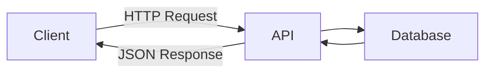
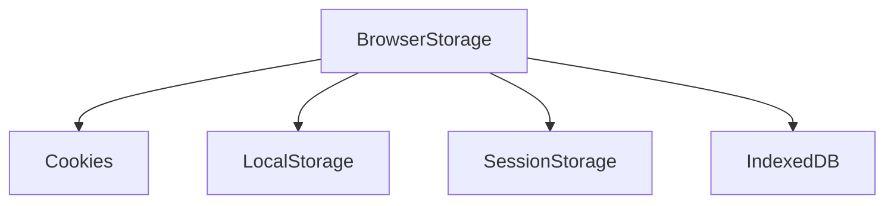
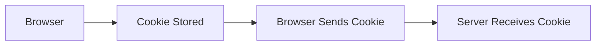
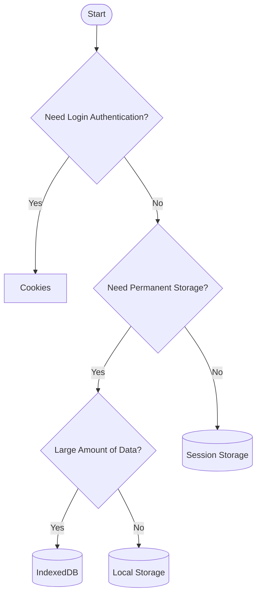

# ***REST APIs & Browser Storage Notes***

> Notes covering REST APIs, Cookies, Local Storage, Session Storage, IndexedDB, and browser storage hierarchy.

---

# REST APIs

**REST (Representational State Transfer)** is a set of architectural principles used to build web APIs.

A REST API allows a **client** (browser/mobile app) to communicate with a **server** using HTTP.

> REST is **not a protocol**. It is an architectural style.

---

## REST Principles

- Client-Server Architecture
- Stateless Communication
- Uses HTTP Methods
- Resources are identified by URLs
- Data is usually exchanged in JSON format
- Uniform Interface

---
## REST Architecture


---

## Why REST APIs are Popular

- Simple
- Fast
- Scalable
- Stateless
- Platform Independent
- Easy to maintain

---
# Browser Storage

 Browser storage refers to the different mechanisms a browser provides to save small amounts of data directly on the user's own computer, rather than on the server.



---

## Cookies

Cookies are **small text files** stored in the browser by websites.

They are mainly used to **remember information** between requests.

### Cookie Types
#### Session Cookies
 Temporary files that are automatically deleted the moment you close your browser. They are used for basic navigation and keeping you logged in during a single visit.

#### Persistent Cookies
 These remain on your device even after you close your browser, lasting until they expire or you delete them. They are used to remember your login details, theme preferences, and language settings for future visits.

---

### Why Cookies are Needed?

HTTP is Stateless.

Cookies help websites remember:

- Logged-in users
- Shopping carts
- Language preference
- User settings

---

### Real-Life Analogy

Imagine visiting a movie theater.

The staff gives you a **ticket**.

Whenever you re-enter, you show the ticket.

The ticket identifies you.

Cookies work similarly.

---
### Cookie Flow

---

### Cookie Characteristics

- Small size (around 4 KB)
- Automatically sent with every request
- Has an expiary date  (if no expiary date is set then cookie will be deleted when the browser is closed)
- Can be Secure and HttpOnly

---

### Uses

- Login session
- Authentication
- User preferences
- Shopping cart

---

## Local Storage

Local Storage stores data permanently inside the browser until it is manually removed.

Unlike cookies, it is **not sent to the server automatically**.

### Characteristics

- Around 5–10 MB storage
- Persists even after closing browser
- Accessible through JavaScript only
- Same-origin only

---

### Real-Life Analogy

A personal notebook.

Whatever you write stays there until you erase it.

---

### Uses

- Dark mode
- Language selection
- User preferences
- Recently viewed products

---

## Session Storage

Session Storage stores data only for the current browser tab.

Once the tab is closed, the data is automatically deleted.

### Characteristics

- About 5 MB storage
- Exists only during one session
- Not shared between tabs
- Accessible through JavaScript

---

### Real-Life Analogy

A classroom whiteboard.

When the class ends, everything is erased.

---

### Uses

- Multi-step forms
- Temporary user data
- OTP verification progress
- Shopping checkout process

---

## IndexedDB

IndexedDB is a **browser database** used to store **large amounts of structured data**.

It is much more powerful than Local Storage.

### Features

- Stores MBs or even GBs of data
- Stores objects
- Supports indexes
- Supports searching
- Asynchronous
- Offline support

---

### Real-Life Analogy

A digital filing cabinet.

Instead of one notebook, you have multiple folders and files organized neatly.

---

### Uses

- Offline web apps
- Large datasets
- File storage
- Progressive Web Apps (PWA)
- Caching API responses

---

### IndexedDB Flow


---
## Storage Hierarchy (Capacity)

```text
Cookies
   │
   ▼
Session Storage
   │
   ▼
Local Storage
   │
   ▼
IndexedDB
```

Capacity increases as we move downward.

---

# Storage Comparison

| Feature | Cookies | Session Storage | Local Storage | IndexedDB |
|----------|----------|----------------|--------------|-----------|
| Capacity | ~4 KB | ~5 MB | ~5–10 MB | Hundreds of MB / GB |
| Lifetime | Until expiry | Until tab closes | Until deleted | Until deleted |
| Sent to Server | ✅ Yes | ❌ No | ❌ No | ❌ No |
| Accessible by JS | Yes* | Yes | Yes | Yes |
| Data Type | String | String | String | Objects, Files, Arrays |
| Speed | Fast | Fast | Fast | Slower but powerful |
| Best For | Authentication | Temporary data | Preferences | Large databases |

> *`HttpOnly` cookies cannot be accessed by JavaScript.

---
# Which Storage Should You Use?


---

# Memory Trick

```
Cookies
↓
Small data
Sent to server

↓

Session Storage
Temporary
One tab only

↓

Local Storage
Permanent
Browser storage

↓

IndexedDB
Browser Database
Large structured data
```

---

