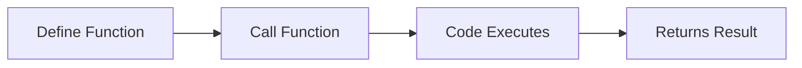
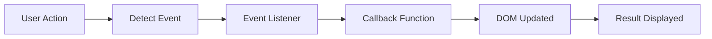
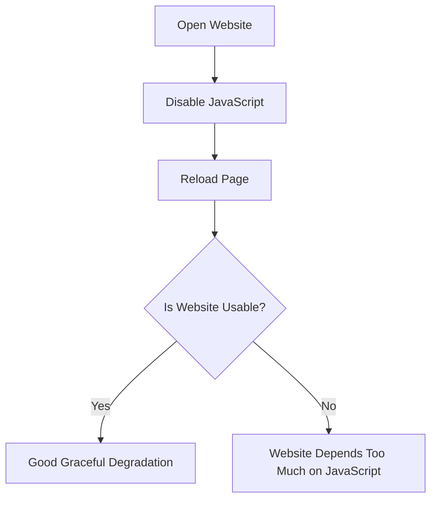

# ***Functions & Events in Javascript***

## What is function?
A function is block of code that perform a specific task/purpose and always **returns some value**.
**Lifecycle of function**

---

## Why use functions?
[x] Reusability
[x] Maintainability
[x] Organised code
[x] Easy debugging
[x] Better readability
[x] Unit Testing

---
## Ideal function
  - performs a single specific task.
  - Be easy to understand.
  - Be reusable.
  - Be easy to test.
  - Be easy to maintain.
  - be short about 20-30 lines.
  - if larger, break into smaller functions.
---
## Syntax of function
```javascript
function add(a, b) // a, b = parameters
{                 //add= function-name
 return a + b; // return = send a value back
}
let total = add(2, 3); // 2, 3 = arguments -> total is 5
```
---
## Parameters and Arguements
| Parameters | Arguments |
|:----------:|:---------:|
| Parameters are the variable list used while function is declared. | Arguements are the actual values passed to tha function while calling. |
| *Placeholders* | *Actual values* |
| Used while defining function | Used while calling function |
| Example: `function add(a, b)` //a and b are parameters | Example: `add(2, 3)`//2 and 3 are arguements|
---
## Return Statement
The `return` keyword sends a value back from the function.

```javascript
function square(n){
    return n*n;
}

let result = square(5);
```
After `return`, the function immediately stops executing.<br>
***#NOTE***
A function always returns some value even if return Statementis not used it hands back an **undefined value**. 

## Functions vs Procedure
| Function | Procedure |
|:----------:|:-----------:|
| Returns a value using `return` | Usually does not return a value |
| Can be used in expressions | Performs an action or task |
| Produces a result | Produces a side effect (e.g., printing, updating DOM) |
| Example: `return a + b;` | Example: `console.log("Hello");` |

---
## Pure vs Impure functions
| Pure Function | Impure Function |
|---------------|-----------------|
| Same input always gives the same output | Same input may produce different outputs |
| No side effects | Has side effects |
| Does not modify external variables | Modifies external variables or state |
| Predictable and easy to test | Less predictable and harder to test |
| Example:function add(a, b) `{`<br>return a + b;<br>`}` | Example: let count = 0;<br>function increment()`{`<br>count++;<br>`}` |
---
## Ways to write a function
### 1. Function Declaration

```javascript
function add(a, b){
    return a+b;
}
```

### 2. Function Expression

```javascript
const add = function(a, b){
    return a+b;
};
```

### 3. Arrow Function

```javascript
const add = (a, b)=>{
    return a+b;
};
```
---
## Five Equivalent Ways
```javascript
// 1. declaration
function add(a, b) { return a + b; }

// 2. expression (function stored in a variable)
const add = function(a, b) { return a + b; };

// 3. arrow, full body
const add = (a, b) => { return a + b; };

// 4. arrow, implicit return
const add = (a, b) => a + b;

// 5. single parameter uses _ when unused
const add = _ => a + b;
```
---
# JavaScript Events

An **event** is an action performed by the user or browser.<br>

Examples:
- Click
- Double Click
- Mouse Move
- Keyboard Input
- Form Submission
- Scroll

**Event Flow**

---
## addEventListener()
Used to attach an event to an element.
```javascript
button.addEventListener("click",changeColor);
});
```
Here changeColor is a **callbackFunction**, the browser calls it back for you when the event happens.<br>

Syntax:
```javascript
element.addEventListener(eventName, callbackFunction)

```
---
## Event Object
The **Event Object** is an object automatically created by the browser whenever an event occurs (such as a click, key press, form submission, or mouse movement).
It contains useful information about the event, including:

- Which element triggered the event
- What type of event occurred
- Mouse position
- Keyboard key pressed
- Time of the event
---
# Common Events

| Event | Description |
|--------|-------------|
| click | Mouse click |
| dblclick | Double click |
| mouseover | Mouse enters |
| mouseout | Mouse leaves |
| mousemove | Mouse movement |
| mousedown | Mouse button pressed |
| keydown | Key pressed |
| keyup | Key released |
| input | Value changes while typing |
| change | Input loses focus |
| submit | Form submitted |
| blur | Element loses focus |
| scroll | Page scrolling |
| resize | Window resized |
| load | Page fully loaded |

---
## Handling events: the pattern
```javascript
// 1. select
const btn = document.querySelector(".btn");
// 2. write the handler
function changeBackgroundColor() {
 document.body.style.background = "lightgrey";
}
// 3. listen, and pass the handler as a callback
btn.addEventListener("mouseout", changeBackgroundColor);
```
---
## Removing Event Listeners
Reasons to remove Event Listeners:
- Improve performance
- Avoid memory leaks
- Disable actions
- One-time events<br>
```javascript
btn.removeEventListener("click",changeColor);
```
---
## If JavaScript is off
