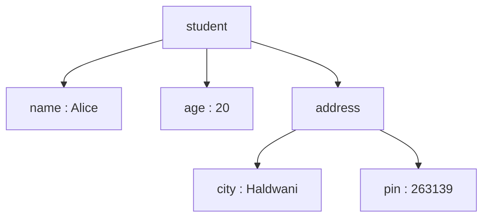

# ***Objects And Array Methods In JavaScript***
---
## Use of Different Brackets in JavaScript
### `{}` Curly Braces
1.**To create an object** — key-value pairs.
```javascript
var product = {"pno": "1", "pname":"monitor", "price":6999, "stock":true  };
```
2.**To wrap a block of code** — whatever goes inside a function, if-statement, or loop sits between curly braces.
```javascript
function greet() {
  console.log("Hello");
}
```
---
### `[]` Square Brackets
1.**To create an array** — an ordered list of values.
```javascript
let num=[1, 2, 3, 4, 5, 6];
```
2.**To access something using an index or key.**
```javascript
product[price];
// getting an object's property using its key
//output: 6999

num[4];
// getting an array item using its index
//output: 5
```
---
### `()`Parentheses or Round Brackets
1.**Calling/running a function**
```javascript
console.log("javascript");
```
2.**Giving a function its parameters**
```javascript
function product(x, y){
    return x*y;
}
```
3.**Holding the small function you pass into an array method**
```javascript
products.forEach(product => console.log(product.name));
```
---
## What is Object?
An **object** is a collection of related data stored as **key-value pairs**.<br>
Each key is a label, and its value is the actual data behind that label.<br>
Example:
```javascript
var product = {
    "pno": "1",
    "pname":"monitor", 
    "price":6999, 
    "stock":true 
};
```
---
**Structure**
```
Object
│
├── key : value
├── key : value
├── key : value
└── key : value

key => property name
value => property value
```
---
**Objects help us:**<br>

- Store related data together<br>
- Improve code readability<br>
- Make code reusable<br>
- Make maintenance easier<br>
- Represent real-world entities<br>
---
**Accessing Properties**
```javascript
product.pname;
// dot notation — most common, use when you know the key name

product[price];
// bracket notation — use when the key is in a variable or has a space
```
---
**Add, Update & Delete Properties**
```javascript
product.vender = "Dell";  // adds a new property

product.price = 6499;   // updates an existing property

delete product.pno;   // removes a property
```
---
**Object Methods & `this`**
Objects can also contain functions called **methods**.<br>
`this` keyword refers to the current object.
```javascript
const student = {
    name: "Alice",

    greet() {
        console.log("Hello " + this.name);
    }
};
```
---
**Looping Through Objects**(Using forEach loop)
Example:
```javascript
for(const key in product){
    console.log(key, product[key]);
}
```
Output:
```
pno 01
pname monitor
price 6999
```
---
| Method | Definition | Example |
|---|---|---|
| `Object.keys(obj)` | returns a new array of just the keys |e.g. Object.keys(product);<br>//output: ["pno", "pname"] |
| `Object.values(obj)` | returns a new array of just the values | e.g. Object.values(product);<br>//output: [01, "monitor"] |
| `Object.entries(obj)` | returns a new array of `[key, value]` pairs |e.g. Object.entries(product) <br> //output:[<br>["pno",01],<br>["pname","monitor"]<br>] |
---
**Nested Objects** - Objects can contain other objects.
```javascript
const student = {
    name:"Alice",
    age:20,
    address:{
        city:"Haldwani",
        pin:263139
    }
};
```
Access
```javascript
student.address.city
```
Structure

---
## Arrays
An array stores multiple values in a single variable.
Example:
```javascript
var marks=[89, 70, 92, 78, 95];
```
---
## Arrays of Objects
```javascript
var product = [
        {
            "no": 1,
            "name": "laptop",
            "price": 49999,
            "stock": true
        },
        {
            "no": 2,
            "name": "monitor",
            "price": 6999,
            "stock": false
        }
];
```
---
## Array Methods
**forEach()**<br>
Runs a function once for every item in the array. It doesn't build or return anything new — it's purely for running an action, like printing each item.
```javascript
const names = products.forEach(product => product.name)
```
---
**map()**<br>
Runs a function on every item and builds a brand new array out of whatever it returns. The original array stays untouched.
```javascript
const names = products.map(product=>product.name);
```
---
**filter()**<br>
Tests every item against a condition. Keeps only the ones that pass, and returns a new array of just those.
```javascript
const expensive = products.filter(p => p.price > 5000);
```
---
**find()**<br>
Searches through the array and returns the first item that matches the condition, then stops looking.<br> 
It gives back a single item, not an array.
```javascript
const laptop = products.find(product=>product.name==="Monitor");
```
---
**some()**<br>
Checks if **at least one** element satisfies the condition. Returns only `true` or `false`.
```javascript
products.some(product=>product.stock);
```
---
**every()**<br>
Checks if **all** elements satisfy the condition — even one failure makes it `false`.
```javascript
products.every(product=>product.stock);
```
---
**sort()**<br>
Sorts the array either in ascending or descending order.
```javascript
//ascending order
products.sort((a,b)=>a.price-b.price);

//descending order
products.sort((a,b)=>b.price-a.price);
```
---
**reduce()**<br>
Combines the entire array down into one final value — like a sum or total. It starts from a given starting value, then keeps adding each item into it.
```javascript
const total = products.reduce((sum,product)=>sum+product.price,0);
```
---
## Array Methods Comparison

| Method | Returns | Purpose |
|---------|----------|----------|
| forEach() | Nothing | Execute code |
| map() | New Array | Transform data |
| filter() | New Array | Keep matching items |
| find() | One Object | Find first match |
| some() | Boolean | Any match? |
| every() | Boolean | All match? |
| sort() | Sorted Array | Arrange elements |
| reduce() | Single Value | Calculate total |

---


